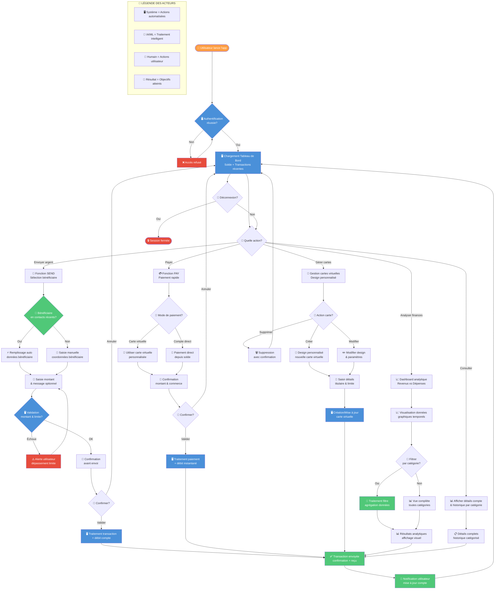

# Claude Code Jumpstart Prompt

En te basant sur le product vision board suivant, la maquette applicative (dans /src) en React et le schéma mermaid ci-dessous, peux-tu faire l'implémentation complète de mon application.

## Stack technique

- **Frontend** : React
- **Backend** : tRPC
- **ORM** : Drizzle
- **Base de données** : Postgres

## Vision :

```json
{
  "projectName": "85",
  "vision": [
    "Être la plateforme bancaire mobile la plus simple et intuitive pour la gestion financière quotidienne",
    "Rendre l'accès aux services bancaires accessible et agréable pour tous",
    "Devenir le partenaire financier de confiance pour la gestion de compte et les transactions"
  ],
  "targetGroup": [
    "Jeunes adultes (18-35 ans) à l'aise avec la technologie",
    "Utilisateurs mobiles cherchant une banque digitale simple",
    "Personnes souhaitant simplifier leur gestion financière personnelle"
  ],
  "needs": [
    "Accès facile et rapide à leurs comptes et soldes",
    "Effectuer des transactions simples (envoi d'argent, paiement) en quelques clics",
    "Suivre leurs revenus et dépenses en temps réel",
    "Gérer plusieurs cartes bancaires facilement",
    "Interface intuitive et design moderne"
  ],
  "product": [
    "Carte bancaire virtuelle personnalisable avec design moderne",
    "Tableau de bord principal montrant solde et transactions récentes",
    "Suivi des revenus et dépenses avec graphiques visuels",
    "Fonctionnalité d'envoi d'argent rapide (Send)",
    "Paiements simplifiés (Pay)",
    "Contacts récents pour transactions rapides",
    "Détails complets des cartes avec informations de titulaire",
    "Historique des transactions par catégorie"
  ],
  "businessGoals": [
    "Acquérir des utilisateurs dans le segment bancaire digital",
    "Augmenter le nombre de transactions par utilisateur",
    "Fidéliser les clients avec une expérience utilisateur supérieure",
    "Générer des revenus via les frais de transactions et services premium"
  ]
}
```

## Flowchart Schema


