# Claude Code Jumpstart Prompt

En te basant sur le product vision board suivant, la maquette applicative (dans /src) en React et le schéma mermaid ci-dessous, peux-tu faire l'implémentation complète de mon application.

## Stack technique

- **Frontend** : React
- **Backend** : tRPC
- **ORM** : Drizzle
- **Base de données** : Postgres

## Vision :

```json
{
  "projectName": "85",
  "vision": [
    "Être la plateforme bancaire mobile la plus simple et intuitive pour la gestion financière quotidienne",
    "Rendre l'accès aux services bancaires accessible et agréable pour tous",
    "Devenir le partenaire financier de confiance pour la gestion de compte et les transactions"
  ],
  "targetGroup": [
    "Jeunes adultes (18-35 ans) à l'aise avec la technologie",
    "Utilisateurs mobiles cherchant une banque digitale simple",
    "Personnes souhaitant simplifier leur gestion financière personnelle"
  ],
  "needs": [
    "Accès facile et rapide à leurs comptes et soldes",
    "Effectuer des transactions simples (envoi d'argent, paiement) en quelques clics",
    "Suivre leurs revenus et dépenses en temps réel",
    "Gérer plusieurs cartes bancaires facilement",
    "Interface intuitive et design moderne"
  ],
  "product": [
    "Carte bancaire virtuelle personnalisable avec design moderne",
    "Tableau de bord principal montrant solde et transactions récentes",
    "Suivi des revenus et dépenses avec graphiques visuels",
    "Fonctionnalité d'envoi d'argent rapide (Send)",
    "Paiements simplifiés (Pay)",
    "Contacts récents pour transactions rapides",
    "Détails complets des cartes avec informations de titulaire",
    "Historique des transactions par catégorie"
  ],
  "businessGoals": [
    "Acquérir des utilisateurs dans le segment bancaire digital",
    "Augmenter le nombre de transactions par utilisateur",
    "Fidéliser les clients avec une expérience utilisateur supérieure",
    "Générer des revenus via les frais de transactions et services premium"
  ]
}
```

## Flowchart Schema

```mermaid
flowchart TD
    Start([👤 Utilisateur lance l'app]) --> Login{🖥️ Authentification<br/>réussie?}
    
    Login -->|Non| AuthFail["❌ Accès refusé"]
    AuthFail --> Login
    
    Login -->|Oui| Dashboard["🖥️ Chargement Tableau de Bord<br/>Solde + Transactions récentes"]
    
    Dashboard --> MainMenu{👤 Quelle action?}
    
    MainMenu -->|Consulter| ViewAccount["📊 Afficher détails compte<br/>& historique par catégorie"]
    MainMenu -->|Envoyer argent| Send["💸 Fonction SEND<br/>Sélection bénéficiaire"]
    MainMenu -->|Payer| Pay["💳 Fonction PAY<br/>Paiement rapide"]
    MainMenu -->|Gérer cartes| CardMgmt["🎴 Gestion cartes virtuelles<br/>Design personnalisé"]
    MainMenu -->|Analyser finances| Analytics["📈 Dashboard analytique<br/>Revenus vs Dépenses"]
    
    Send --> SelectRecipient{🤖 Bénéficiaire<br/>en contacts récents?}
    SelectRecipient -->|Oui| QuickSend["⚡ Remplissage auto<br/>données bénéficiaire"]
    SelectRecipient -->|Non| ManualEntry["👤 Saisie manuelle<br/>coordonnées bénéficiaire"]
    
    QuickSend --> EnterAmount["👤 Saisie montant<br/>& message optionnel"]
    ManualEntry --> EnterAmount
    
    EnterAmount --> Validate{🖥️ Validation<br/>montant & limite?}
    Validate -->|Échoue| Error["⚠️ Alerte utilisateur<br/>dépassement limite"]
    Error --> EnterAmount
    
    Validate -->|OK| Confirm["👤 Confirmation<br/>avant envoi"]
    Confirm --> ConfirmChoice{👤 Confirmer?}
    ConfirmChoice -->|Annuler| Dashboard
    ConfirmChoice -->|Valider| Process["🖥️ Traitement transaction<br/>+ débit compte"]
    
    Pay --> PayMethod{👤 Mode de paiement?}
    PayMethod -->|Carte virtuelle| VirtualCard["🎴 Utiliser carte virtuelle<br/>personnalisée"]
    PayMethod -->|Compte direct| DirectPay["🏦 Paiement direct<br/>depuis solde"]
    
    VirtualCard --> PayConfirm["👤 Confirmation<br/>montant & commerce"]
    DirectPay --> PayConfirm
    
    PayConfirm --> PayChoice{👤 Confirmer?}
    PayChoice -->|Annuler| Dashboard
    PayChoice -->|Valider| PayProcess["🖥️ Traitement paiement<br/>+ débit instantané"]
    
    CardMgmt --> CardAction{👤 Action carte?}
    CardAction -->|Créer| NewCard["🎨 Design personnalisé<br/>nouvelle carte virtuelle"]
    CardAction -->|Modifier| EditCard["✏️ Modifier design<br/>& paramètres"]
    CardAction -->|Supprimer| DeleteCard["🗑️ Suppression<br/>avec confirmation"]
    
    NewCard --> CardDetails["👤 Saisir détails<br/>titulaire & limite"]
    EditCard --> CardDetails
    DeleteCard --> Dashboard
    
    CardDetails --> CardCreate["🖥️ Création/Mise à jour<br/>carte virtuelle"]
    
    Analytics --> AnalysisDisplay["📈 Visualisation données<br/>graphiques temporels"]
    AnalysisDisplay --> CategoryFilter{👤 Filtrer<br/>par catégorie?}
    CategoryFilter -->|Oui| FilterData["🤖 Traitement filtre<br/>agrégation données"]
    CategoryFilter -->|Non| FullData["📊 Vue complète<br/>toutes catégories"]
    
    FilterData --> AnalysisResult["📊 Résultats analytiques<br/>affichage visuel"]
    FullData --> AnalysisResult
    
    ViewAccount --> AccountDetails["📋 Détails complets<br/>historique catégorisé"]
    
    Process --> Success["✅ Transaction envoyée<br/>confirmation + reçu"]
    PayProcess --> Success
    CardCreate --> Success
    AnalysisResult --> Success
    AccountDetails --> Success
    
    Success --> Notification["📲 Notification utilisateur<br/>mise à jour compte"]
    Notification --> Dashboard
    
    Dashboard --> Logout{👤 Déconnexion?}
    Logout -->|Oui| End(["🔒 Session fermée"])
    Logout -->|Non| MainMenu
    
    style Start fill:#FF9F43,color:#fff
    style End fill:#E74C3C,color:#fff
    style AuthFail fill:#E74C3C,color:#fff
    style Error fill:#E74C3C,color:#fff
    style Success fill:#50C878,color:#fff
    style Notification fill:#50C878,color:#fff
    
    style Dashboard fill:#4A90D9,color:#fff
    style Process fill:#4A90D9,color:#fff
    style PayProcess fill:#4A90D9,color:#fff
    style CardCreate fill:#4A90D9,color:#fff
    style Validate fill:#4A90D9,color:#fff
    style Login fill:#4A90D9,color:#fff
    
    style SelectRecipient fill:#50C878,color:#fff
    style FilterData fill:#50C878,color:#fff
    
    subgraph Legend["🎨 LÉGENDE DES ACTEURS"]
        L1["🖥️ Système = Actions automatisées"]
        L2["🤖 IA/ML = Traitement intelligent"]
        L3["👤 Humain = Actions utilisateur"]
        L4["🎯 Résultat = Objectifs atteints"]
    end
```


